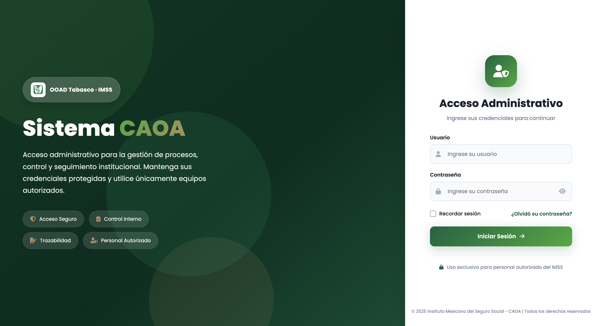
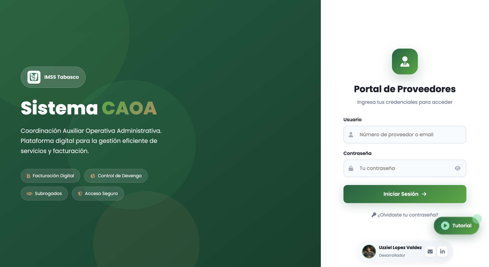
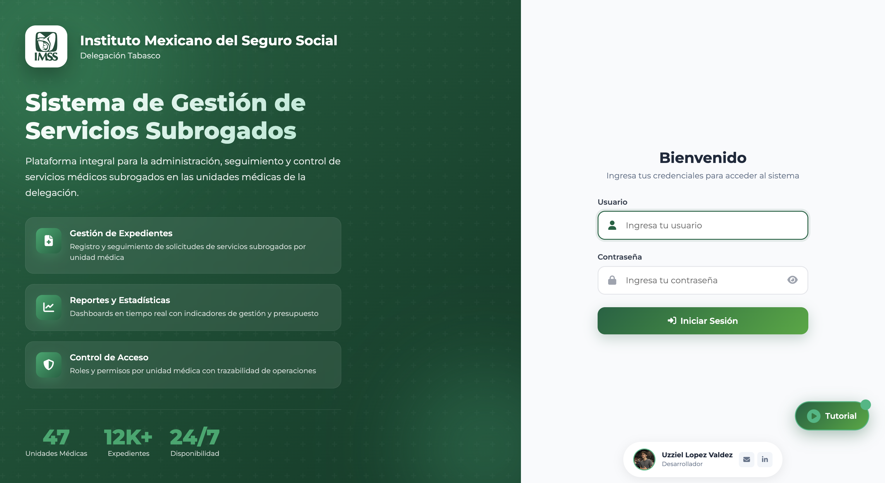
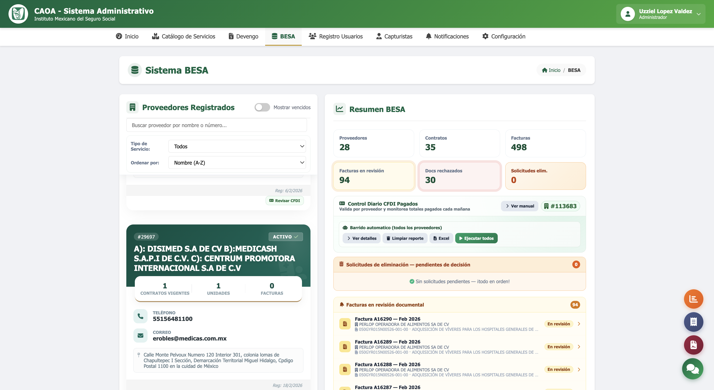
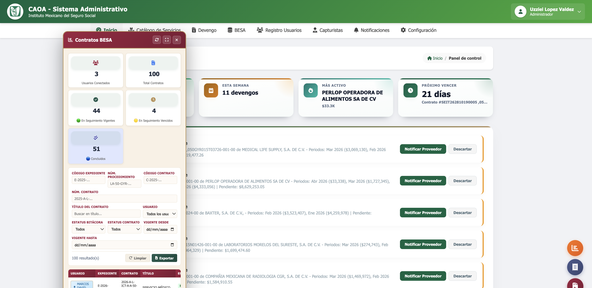
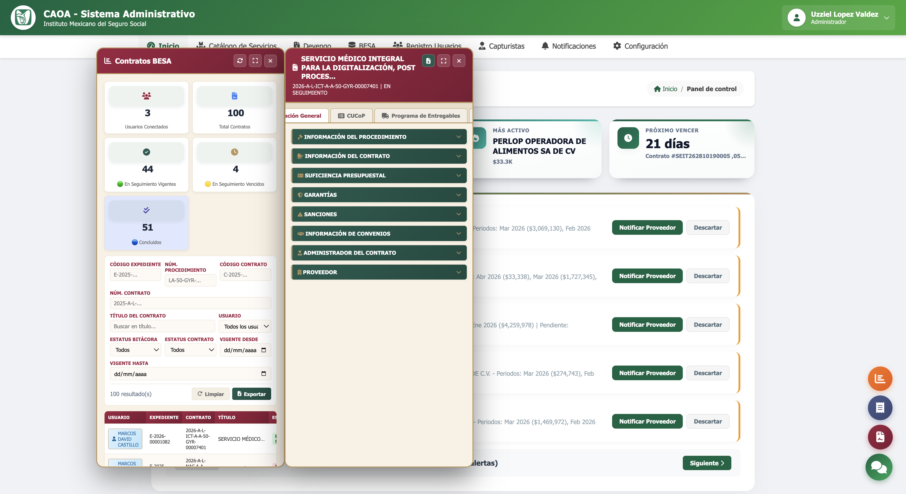
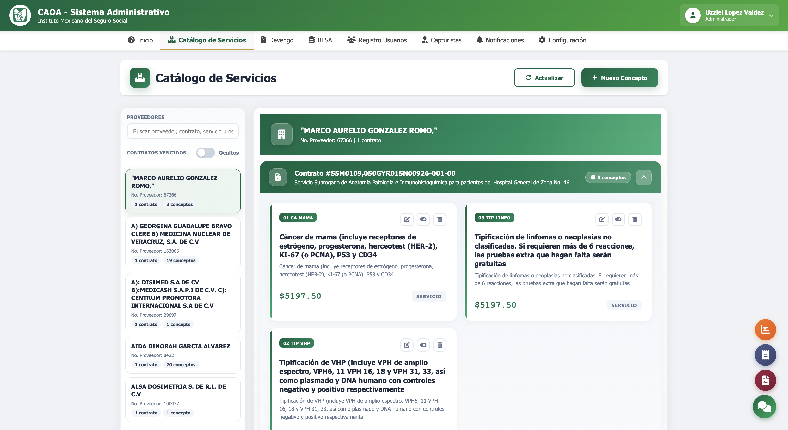
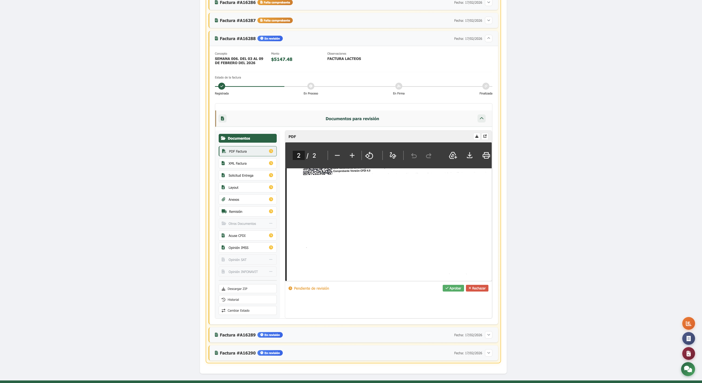
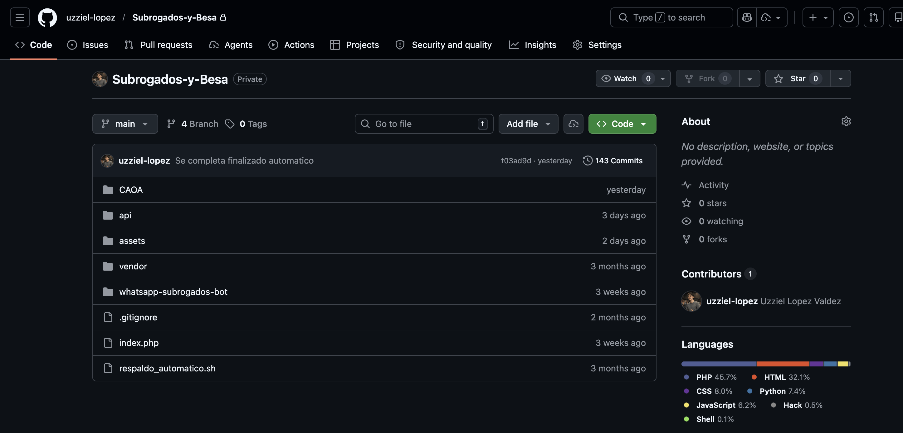

# Sistema IMSS - Subrogados y CAOA

## Descripcion general

Este repositorio publica una version demo simplificada para portafolio.

El sistema real es institucional, privado y de mayor escala. No se publica porque maneja informacion sensible en finanzas, operacion, trazabilidad documental e integraciones internas.

La intencion de esta version publica es documentar la arquitectura real y mostrar una implementacion tecnica representativa sin exponer datos reservados.

## Alcance del sistema real (privado)

El sistema original integra dos frentes principales:

1. Sistema de Subrogados (operacion medica y administrativa)
2. Sistema CAOA (control administrativo, operativo y financiero)

### Subrogados

- Gestion de pacientes y servicios subrogados
- Control presupuestal mensual por unidad/servicio
- Generacion de documentos PDF/Excel
- Endpoints para procesos operativos y reportes

### CAOA

- Registro y administracion de contratos, proveedores y capturistas
- Carga y validacion documental de facturas
- Flujo de revision/aprobacion/rechazo por documento
- Integraciones con BESA y modulos financieros
- Procesamiento batch de XML/PDF y trazabilidad

## Estructura real de referencia

```text
Subrogados-y-Besa/
├── CAOA/
│   ├── Administrador/
│   │   ├── api/
│   │   ├── assets/js/
│   │   ├── config/
│   │   ├── configuracion/
│   │   │   ├── besa/
│   │   │   │   ├── php/
│   │   │   │   └── python/
│   │   │   ├── finanzas/
│   │   │   │   ├── php/
│   │   │   │   └── python/
│   │   │   ├── reportes/
│   │   │   │   ├── php/
│   │   │   │   └── python/
│   │   │   ├── unidades/
│   │   │   └── perfiles/usuarios/
│   │   ├── db/
│   │   ├── funciones/
│   │   │   ├── capturistas/
│   │   │   ├── chat/
│   │   │   ├── dashboard/
│   │   │   ├── contratos/proveedores/devengos/
│   │   │   └── notificaciones/eventos/
│   │   ├── includes/
│   │   └── paginas: inicio, devengos, besa, registro, configuracion
│   ├── Usuarios/
│   │   ├── assets/js/
│   │   ├── db/
│   │   ├── funciones/
│   │   │   ├── dashboard/
│   │   │   ├── facturas/devengos/documentos/
│   │   │   ├── reportes/eventos/
│   │   │   └── autenticacion/
│   │   ├── includes/
│   │   ├── widgets/
│   │   └── paginas: inicio, facturas, devengo, reportes, notificaciones
│   └── proxy.js
├── api/
│   ├── buscar_personal.php
│   ├── reportes.php
│   ├── subrogados.php
│   ├── pacientes.php
│   ├── exportar_pdf*.php
│   ├── exportar_reporte_excel.php
│   └── verificacion_qr.php
├── assets/
│   ├── includes/ (pacientes, subrogados, sidebar, top_navbar)
│   ├── js/       (dashboard, subrogados, pacientes, reportes)
│   ├── tools/    (debug PDF)
│   └── utils/tools/ (imports y utilidades)
├── whatsapp-subrogados-bot/
│   ├── src/
│   ├── index.js
│   └── ecosystem.config.js
├── paginas raiz: dashboard.php, pacientes.php, reportes.php, subrogados.php
└── soporte: config.php, scripts, composer
```

## Arquitectura funcional del sistema real

### Capa administrativa (CAOA/Administrador)

- Gestion integral de proveedores, contratos, unidades medicas y capturistas.
- Control de devengos y trazabilidad de estados financieros por contrato.
- Integracion con BESA y servicios de finanzas para consulta/descarga de comprobantes.
- Reporteria operativa y consolidada para seguimiento institucional.

### Capa operativa de usuarios (CAOA/Usuarios)

- Portal de proveedores para carga y gestion documental.
- Registro de facturas por contrato/unidad/periodo.
- Validacion de documentos por estatus (pendiente, aprobado, rechazado).
- Seguimiento de incidencias, notificaciones y eventos asociados.

### Capa de integracion

- Endpoints PHP para operaciones de negocio, exportaciones y verificaciones.
- Servicios Python para automatizacion BESA/finanzas y procesos batch.
- Servicio Node para notificaciones por mensajeria.

### Capa de interfaz

- Modulos visuales por rol (Administrador/Usuario).
- Componentes reutilizables de layout, modales y widgets.
- Scripts front para dashboards, validaciones y flujos de captura.

## Flujo operativo real

1. El administrador registra y configura contratos con proveedores y unidades.
2. Se asignan montos por unidad medica y se gestionan devengos periodicos.
3. El proveedor captura facturas y adjunta evidencia documental.
4. El sistema valida estructura documental y reglas de negocio.
5. El area administrativa revisa, aprueba o rechaza documentos con motivo.
6. Se ejecutan procesos batch para consolidar XML/PDF y reportes.
7. Se genera trazabilidad historica para auditoria y seguimiento institucional.

## Modulos principales del sistema real

- Contratos y proveedores
- Presupuesto y devengos
- Facturacion y validacion documental
- BESA y finanzas
- Reportes y exportaciones
- Notificaciones y seguimiento
- Chat y colaboracion operativa
- Auditoria y bitacora de cambios

## Evidencia visual del sistema real (privado)

Las siguientes capturas corresponden al entorno real privado:











## Consideraciones de privacidad

- No contiene credenciales productivas
- No expone informacion financiera institucional
- Usa datos y rutas de demostracion
- Se publica para mostrar arquitectura y logica de negocio
